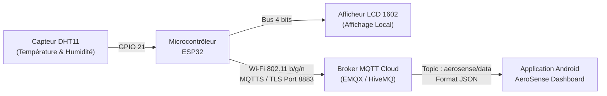

<div align="center">


# 🌤️ AeroSense - Station Météo Intelligente & Connectée IoT

[](https://platformio.org/)
[](https://developer.android.com/jetpack/compose)
[](https://mqtt.org/)
[](https://www.labcenter.com/)
[](LICENSE)

<p align="center">
  <b>Système complet IoT de surveillance météorologique et de qualité de l'air ambiant</b><br>
  Microcontrôleur ESP32 • Capteur DHT11 • Afficheur LCD 1602 • Broker Cloud MQTT (TLS) • Dashboard Mobile Android Jetpack Compose
</p>


</div>

---

## 📌 Présentation du Projet

**AeroSense** est une solution complète de station météorologique connectée pour la surveillance en temps réel de la température et de l'humidité relative. Le projet intègre l'ensemble de la chaîne de valeur d'un produit IoT :

1. **Système Embarqué (Hardware & Firmware) :**
   - Microcontrôleur **ESP32** assurant l'acquisition des données du capteur **DHT11**.
   - Affichage local instantané sur un écran **LCD 1602**.
   - Transmission sans fil sécurisée via le protocole **MQTT sur TLS/SSL (port 8883)** vers un broker Cloud.
2. **Conception Électronique & PCB :**
   - Schéma électronique et routage PCB sous **Proteus Design Suite 8**.
   - Vues et bibliothèques d'empreintes 3D (ESP32, TP4056, MT3608, USB-C, LCD 1602).
3. **Application Mobile (Dashboard Android) :**
   - Application native moderne développée en **Kotlin** avec **Jetpack Compose** et Material Design 3.
   - Connexion temps réel au broker MQTT, affichage de jauges animées, alertes automatiques et graphiques d'évolution.

---

## 📂 Structure du Répertoire

```text
AeroSense/
├── AeroSense_LOGO.png              # Logo officiel du projet
├── AeroSense.png                   # Bannière de présentation visuelle
├── Code_ESP32/                     # Firmware embarqué ESP32 (PlatformIO)
│   ├── README.md                   # Documentation technique détaillée du firmware
│   └── StationMeteo/
│       ├── platformio.ini          # Dépendances et configuration PlatformIO
│       └── src/
│           ├── config.h            # Configuration Wi-Fi et identifiants MQTT
│           └── main.cpp            # Code source principal commenté
├── ConceptionElectrique/           # Schématique et conception PCB (Proteus)
│   └── Station Météo IoT.pdsprj    # Fichier projet Proteus 8
├── Dashboard_AndroidApp/           # Application mobile Android (Jetpack Compose)
│   ├── app/src/main/
│   │   ├── java/com/.../           # Code source Kotlin (ViewModel, UI, MQTT)
│   │   └── res/                    # Ressources visuelles, icônes, thèmes
│   └── build.gradle.kts
└── Doc/                            # Documentation matérielle & bibliothèques EDA
    ├── PCB_Views/                  # Vues du circuit imprimé (PDF)
    └── Proteus_Library/            # Modèles et empreintes CAO (ESP32, LCD, etc.)
```

---

## ⚡ Architecture Système



---

## 🛠️ Démarrage Rapide

### 1. Firmware ESP32
Consultez la [documentation complète du firmware ESP32](./Code_ESP32/README.md).
- Rendez-vous dans `Code_ESP32/StationMeteo/`.
- Renseignez vos identifiants Wi-Fi et MQTT dans `src/config.h`.
- Téléversez avec PlatformIO : `pio run --target upload`.

### 2. Application Android Dashboard
- Ouvrez le dossier `Dashboard_AndroidApp` dans **Android Studio** (Giraffe ou version supérieure).
- Compilez et exécutez sur votre smartphone ou émulateur Android (API 26+).
- Configurez les paramètres du broker via la boîte de dialogue intégrée si nécessaire.

---

## 📄 Licence

Ce projet est sous licence MIT - voir le fichier [LICENSE](LICENSE) pour plus d'informations.
